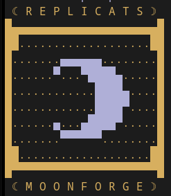

# M O O N F O R G E

## Build & Package
### Requirements:
- Portaudio
- Lua

### Build
```bash
./pkg.sh
```

Final packaged build files will be in `./dist`.

## Run

### Run Syntax:
```bash
./mf <path/to/file.lua>
```

### Run Example:
```bash
./mf examples/test.lua
```

## Lua API
See the [MF Lua API Docs](doc/API.md) for core API functions.

## Higher Level Libraries
This project also includes `mflib.lua` which contains wrapper functions around the main API which make it easier to work with. 
